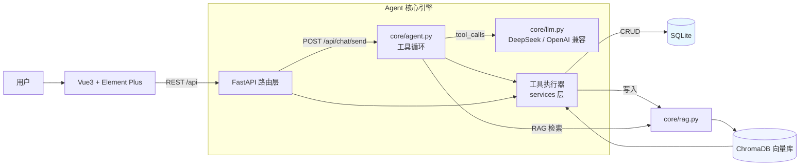

# 项目管理 Agent（Project Manager Agent）

> 基于大语言模型（LLM）的智能项目管理助手 —— 用自然语言管理项目与任务，内置 RAG 知识库问答与可视化看板。

---

## 一、项目简介

传统项目管理工具（Jira / Trello）功能强大但操作繁琐。本项目借助大模型理解能力，让用户**用自然语言**即可完成项目创建、任务管理与进度查询，并支持：

- 🗣️ **自然语言驱动**：`帮我创建一个名为「电商系统」的项目，包含 5 个任务` —— Agent 自动解析意图并执行操作
- 🤖 **Agent 工具调用**：多轮对话中自主决策调用「建项目 / 建任务 / 改状态 / 检索知识库」等工具，链路可观测
- 📚 **RAG 知识库问答**：上传项目文档自动分块向量化，提问时检索相关片段、基于文档作答（不编造）
- 📋 **看板可视化**：任务按 待办 / 进行中 / 已完成 三栏展示，支持**拖拽跨栏**直接流转状态
- 📊 **数据仪表盘**：项目 / 任务统计与状态分布一目了然

## 二、技术栈

| 层 | 技术 | 版本 | 用途 |
|---|---|---|---|
| 后端 | Python / FastAPI | 3.13 / 0.141 | Web 框架与 REST API |
| AI | OpenAI SDK（DeepSeek 兼容端点实测） | 3.x | LLM 调用（Function Calling 工具循环） |
| 向量库 | ChromaDB + ONNX MiniLM | 1.5.9 | 文档 Embedding 存储与 Top-K 检索 |
| 业务库 | SQLite + SQLAlchemy | 2.0 | 六张业务表 ORM 管理 |
| 前端 | Vue3 + Element Plus + Pinia | 3.4 / 2.7 | 看板 / 对话 / 仪表盘 / 知识库界面 |
| 构建 | Vite | 5 | 前端工程化（dev 代理 /api → 8000） |

> Agent 引擎为**手写 Function Calling 工具循环**（约 200 行，见 `backend/core/agent.py`），不依赖 LangChain 黑盒：每步模型决策可打印、可调试；如需接入 LangChain 生态，仅需替换该文件内部实现。

## 三、系统架构



**一次对话的执行链路**（`帮我看看电商系统有哪些营销工具`）：
用户消息 → 落库 → 携带最近 20 条上下文组装 messages → LLM 决策「调用 search_knowledge」→ 检索 ChromaDB 命中《电商系统需求说明》片段 → 结果回填再次请求 → LLM 基于检索内容组织自然语言回答 → 回复落库返回前端。

## 四、快速开始

### 0. 环境要求
- Python ≥ 3.10，Node.js ≥ 18
- 一个 OpenAI 兼容的 LLM API Key（官方 / DeepSeek / 任一兼容中转均可）

### 1. 后端启动
```bash
cd backend
cp .env.example .env        # 填写 OPENAI_API_KEY / OPENAI_BASE_URL / LLM_MODEL
pip install -r requirements.txt
python seed.py              # 可选：生成演示数据（1 用户 / 2 项目 / 8 任务 / 1 篇知识库文档）
uvicorn main:app --reload   # http://127.0.0.1:8000  （Swagger 文档 /docs）
```

### 2. 前端启动
```bash
cd frontend
npm install
npm run dev                 # http://localhost:5173 （已代理 /api → 8000）
```

### 3. 体验演示
| 入口 | 自然语言指令 | 预期行为 |
|---|---|---|
| AI 对话 | `帮我创建一个叫「短视频运营」的项目，描述是 内容排期与数据复盘` | Agent 调用工具建项目落库 |
| AI 对话 | `给电商系统项目加一个任务：上线前回归测试` | 自动定位项目并建任务 |
| AI 对话（绑定电商系统） | `这个项目有哪些营销工具？` | 触发 RAG 检索知识库文档作答 |
| 项目看板 | 拖拽任务卡片跨栏 | 状态实时流转（PATCH） |

演示账号：seed 内置 `alice`（user_id=1，无登录体系，demo 用）。

## 五、目录结构

```
project-manager-agent/
├── backend/                  # Python 后端
│   ├── main.py               # FastAPI 入口（启动建表 + 路由注册）
│   ├── seed.py               # 演示数据脚本（幂等）
│   ├── core/                 # 核心模块
│   │   ├── config.py         # .env 集中配置（路径锚定 backend）
│   │   ├── agent.py          # Agent 工具循环（手写 Function Calling）
│   │   ├── llm.py            # LLM 统一封装
│   │   └── rag.py            # ChromaDB 入库/检索/清理
│   ├── models/               # database.py（六表 ORM）/ schemas.py（Pydantic v2）
│   ├── services/             # 业务服务层（API 与 Agent 共用）
│   └── api/                  # REST 路由（projects / tasks / knowledge / chat）
├── frontend/                 # Vue3 前端
│   └── src/
│       ├── views/            # Dashboard / ProjectBoard / ChatView / KnowledgeBase
│       ├── components/       # Sidebar / TaskCard / ChatMessage
│       ├── stores/           # Pinia（项目状态）
│       └── api/index.js      # axios 封装
└── sql/init.sql              # 数据库初始化脚本（与 ORM 对齐）
```

## 六、API 一览

| 方法 | 路径 | 说明 |
|---|---|---|
| GET/POST | `/api/projects` | 项目列表 / 创建（?user_id=） |
| PATCH/DELETE | `/api/projects/{id}` | 更新 / 删除（级联清理任务与向量） |
| GET/POST | `/api/tasks?project_id=` | 任务列表 / 创建 |
| PATCH/DELETE | `/api/tasks/{id}` | 状态流转（拖拽） / 删除 |
| GET/POST | `/api/projects/{pid}/documents` | 知识库文档列表 / 上传（multipart，自动向量化） |
| DELETE | `/api/documents/{id}` | 删除文档（同步清向量） |
| POST | `/api/chat/send` | 自然语言对话（Agent 全链路） |
| GET | `/api/chat/history` | 对话历史 |

交互式文档：后端启动后访问 `/docs`。

## 七、数据模型（六张表）

`users` / `projects` / `tasks` / `task_comments` / `chat_messages` / `knowledge_documents`
关联：用户 1-N 项目；项目 1-N 任务与知识库文档；任务 1-N 评论；任务可指派用户。业务数据存 SQLite，文档向量存 ChromaDB，两库由 services 层保持一致性（删除项目/文档时同步清理向量）。

## 八、国内环境注意事项

- npm 建议使用镜像源：`npm config set registry https://registry.npmmirror.com`
- ChromaDB 内置 ONNX 模型默认从 AWS S3 下载（国内易超时）。若首次运行报下载超时，可将 `sentence-transformers/all-MiniLM-L6-v2` 的 6 个文件（config.json / model.onnx / special_tokens_map.json / tokenizer_config.json / tokenizer.json / vocab.txt，经 hf-mirror.com 获取）放置到 `~/.cache/chroma/onnx_models/all-MiniLM-L6-v2/onnx/` 即可跳过下载。

## 九、实现状态

- [x] P1 后端核心：LLM 调用 / 数据层 / 向量库 RAG / 业务 API / Agent 链路（端到端验收通过）
- [x] P2 前端：仪表盘 / 看板拖拽 / AI 对话 / 知识库管理（与后端联调通过）
- [ ] P3 打磨：部署上线可访问 Demo / 按需引入优化 / 单测补充
