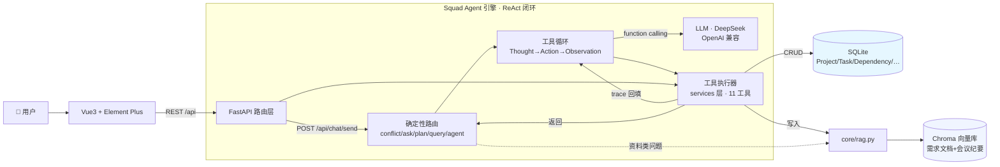

# Squad · 小队智脑

> **面向 2–6 人小型研发团队的 AI 项目管理 Agent。**
> 你说目标，Squad 自主完成项目规划、任务拆解、依赖分析、进度跟踪、风险识别与资料记忆——
> 让没有专职 PM 的小队，也能拥有一个 24 小时在线的项目协管。

[](https://python.org)
[](https://fastapi.tiangolo.com)
[](https://vuejs.org)
[](#)

---

## 为什么做它（背景与痛点）

小型研发团队（2–6 人）通常**没有专职 PM**：组长兼着排期、成员自己记进度、资料散落在聊天记录和本地文档里。传统项目管理工具（Jira / 禅道）为大组织设计——流程重、配置繁琐，小队用起来反而拖慢节奏，于是干脆不用。

| 小队的真实痛点 | 传统工具的做法 | Squad 的做法 |
|---|---|---|
| 项目目标到任务拆解全靠口头，标准不一 | 手动建任务、填字段、排优先级 | 一句话目标 → Agent **自主规划任务树**（含依赖）并入库 |
| 进度靠站会/表格人工同步，前置延期影响说不清 | 看板手动拖拽，延期靠人肉通知 | 问"进度怎么样" → Agent **读真实数据**作答，依赖未就绪任务自动标记阻塞 |
| 需求、会议纪要散落，新成员找不到"上次怎么定的" | 专门的文档系统，需另建库维护 | 会议纪要一键入库 → 对话时 **RAG 自动检索**注入，Agent 记得项目历史 |
| 项目多、状态靠脑子记 | 全局仪表盘靠管理员配 | 状态实时派生，看板 / 仪表盘 / 对话三处一致 |

**一句话**：Squad 把"管项目"从"人围着工具转"变成"Agent 围着项目转"——你只需要说，剩下交给它。

---

## Agent 核心能力（区别于普通 LLM 问答）

Squad 不是"套壳 ChatGPT 做文本总结"，而是具备 **ReAct 闭环**的智能体：**思考（Thought）→ 选工具（Action）→ 看结果（Observation）→ 再思考**，自主完成项目管理动作。

| 能力 | 说明 | 示例 |
|---|---|---|
| 🤖 **自主规划 Planner** | 解析自然语言目标 → 输出**带依赖关系的任务树**（depends_on 下标引用 → 落库成真实依赖边） | "帮我规划电商系统的上线" → 5 个任务 + 依赖关系自动入库 |
| 🛠 **可插拔工具集** | Agent 按需调用 11 种工具：建任务 / 改状态 / 删改 / 查进度 / 检索资料 / 自动规划；工具按绑定项目裁剪，杜绝跨项目误操作 | "把「联调」标记完成" → 调 `update_task_status`；"删掉 XX 任务" → 调 `delete_task` |
| 🧠 **项目长期记忆（RAG）** | Chroma 向量库存需求文档与会议纪要；绑定项目后问资料类问题 → **代码层自动检索** top-k 注入思考，不靠模型自觉 | 录入《2026-09-01 迭代评审》后问"上次怎么定的登录方案" → 命中会议纪要作答 |
| 📊 **真实状态感知** | 问进度/状态 → Agent **先读库再作答**（状态分布、未完成高优、依赖阻塞），绝不凭空编造 | "项目进度怎么样了" → 回复基于真实任务快照 |
| 🧾 **可观测执行轨迹** | 每一步工具调用（工具名/摘要/耗时/影响的实体）落库并在前端时间线回放，Agent 行为全程可见 | 对话下方展开"Agent 执行过程"，点击实体直达看板 |
| 🔒 **确定性安全路由** | 高确定性场景代码层先裁决：跨项目写数据拦截、只给数量没给明细先追问、纯规划直行——把模型幻觉和串扰掐在源头 | 绑定 A 却说"给 B 规划" → 拦截提示先切换，绝不建错项目 |

> 架构上刻意**手写工具循环**（约 300 行，`backend/core/agent.py`）而非套 LangChain 黑盒——每步决策可打印、可调试、可测试。

---

## 系统架构



**一次真实对话的执行链路**（绑定项目后问"上次评审怎么定的登录方案"）：

```
用户消息 → 落库 → 确定性路由判定"资料类问题"
   → 代码层自动 RAG 检索会议纪要 top-k（trace: 检索项目记忆）
   → 命中片段注入 system 上下文
   → LLM 基于原文组织回答 → 回复落库 + trace 回放
```

---

## 快速开始

### 方式一：Docker 一键部署（推荐）

```bash
docker compose up -d --build     # 构建并启动（前端 8080 + nginx 反代 /api）
docker compose exec backend python seed.py    # 可选：灌入演示数据
# 浏览器打开 http://localhost:8080
```

设计要点：后端容器**不映射宿主端口**，由 nginx 反代——彻底规避本地端口被旧进程占用的僵尸问题；SQLite + Chroma 落宿主 `./docker_data/`，`down` 不丢数据。详见 [`docs/DEPLOY_DOCKER.md`](docs/DEPLOY_DOCKER.md)。

### 方式二：本地开发

```bash
# 后端（Python ≥ 3.10）
cd backend
cp .env.example .env          # 填 OPENAI_API_KEY / OPENAI_BASE_URL / LLM_MODEL
pip install -r requirements.txt
python seed.py                # 可选：演示数据（1 用户 / 2 项目 / 8 任务 / 1 知识库文档）
uvicorn main:app --reload     # http://127.0.0.1:8000  Swagger: /docs

# 前端（Node ≥ 18）
cd frontend
npm install
npm run dev                   # http://localhost:5173 （已代理 /api → 后端）
```

> 💡 Windows 本地开发遇到"改了代码接口仍是旧行为/404"？先读 [`docs/DEV_OPS.md`](docs/DEV_OPS.md)——端口僵尸进程排查与"重启后探针验证"纪律。

### 体验演示

| 入口 | 说这句话 | 你会看到 |
|---|---|---|
| AI 对话 | `帮我创建一个叫「短视频运营」的项目，描述是 内容排期与数据复盘` | Agent 调 `create_project` 建库，轨迹可见 |
| 项目看板 | 新建项目勾选「AI 一键规划」 | 任务树（含依赖）自动生成 |
| AI 对话（绑定项目） | `项目进度怎么样了` | 轨迹首屏"读取项目状态"，回复基于真实数据 |
| AI 对话（绑定项目） | `删掉「XX」任务` / `把「XX」改名为 YY` | 调 `delete_task` / `update_task_fields` |
| AI 对话（绑定项目） | 上传会议纪要后问 `上次怎么定的登录方案` | 轨迹首屏"检索项目记忆"，按原文作答 |
| 数据仪表盘 | — | 任务/项目状态实时派生，与看板一致 |

---

## 技术栈

| 层 | 技术 | 用途 |
|---|---|---|
| 后端 | Python / FastAPI | Web 框架与 REST API |
| AI | OpenAI SDK（DeepSeek 兼容端点实测） | LLM 调用 + Function Calling 工具循环 |
| 向量库 | ChromaDB + ONNX MiniLM | 文档/会议纪要 Embedding 与 Top-K 检索 |
| 业务库 | SQLite + SQLAlchemy | 七张业务表 ORM 管理 + 轻量迁移 |
| 前端 | Vue3 + Element Plus + Pinia | 看板 / 对话 / 仪表盘 / 知识库界面 |
| 部署 | Docker Compose + Nginx | 前后端容器化、反代、数据卷持久化 |

## 数据模型（核心表）

`users` / `projects` / `tasks` / `task_dependencies` / `task_comments` / `chat_messages` / `knowledge_documents`

- **TaskDependency**：任务依赖建模（task 依赖 depends_on 前置任务），服务层校验**自依赖 / 跨项目 / 成环**，支持"前置延期 → 影响哪些下游"的影响分析（`/api/tasks/{id}/impact`）
- **KnowledgeDocument.doc_type**：`doc`（需求/方案文档）与 `meeting`（会议纪要，项目长期记忆）同库分型
- **ChatMessage.trace**：Agent 执行轨迹 JSON（每步工具 + 受影响实体），历史消息可回放

## 目录结构

```
project-manager-agent/
├── backend/
│   ├── main.py              # FastAPI 入口（启动建表 + 轻量迁移）
│   ├── core/
│   │   ├── agent.py         # ★ ReAct 工具循环 + 工具定义 + 确定性路由（~700 行）
│   │   ├── llm.py           # ★ LLM 封装：chat / chat_text / chat_json（JSON 校验+重试）
│   │   ├── rag.py           # Chroma 分块入库 / 按项目检索 / 同步清理
│   │   └── config.py        # .env 集中配置
│   ├── services/            # 业务服务层（API 与 Agent 共用）
│   ├── api/                 # REST 路由（projects/tasks/knowledge/chat/plan/impact）
│   └── tests/               # pytest 37 用例（LLM mock，离线可跑）
├── frontend/src/            # Vue3：Dashboard / ProjectBoard / ChatView / KnowledgeBase
├── docs/                    # DEV_OPS.md（本地运维）/ DEPLOY_DOCKER.md（容器部署）
└── docker-compose.yml       # 一键部署
```

---

## 工程化亮点（LLM 稳定性）

- **JSON 结构化输出容错**（`llm.chat_json`）：自动追加"只输出 JSON"约束 → 剥离 ```json 围栏 → 容忍前后夹带文字截取合法片段 → 解析失败把原始输出+错误回传**引导模型自纠错重试** → 仍失败返回错误不抛异常
- **确定性路由先于模型**：跨项目冲突 / 只给数量没明细 / 纯规划 / 进度查询，四类高确定性场景由代码裁决，把模型幻觉与串扰掐在源头
- **Agent 可观测**：每步工具调用（名称/摘要/耗时/影响实体）写入 trace，前端时间线回放——面试可现场演示"Agent 每一步在干什么"

---

## 实现状态

- [x] ReAct 工具循环：Thought→Action→Observation，11 种工具，最大 8 轮防死循环
- [x] Planner：自然语言目标 → 带依赖任务树（depends_on 下标 → 真实依赖边）
- [x] 任务依赖建模：TaskDependency 表 + 成环/跨项目校验 + 影响分析
- [x] 项目长期记忆：会议纪要/需求文档入库，资料类问题自动 RAG 注入
- [x] 真实状态感知：进度查询先读库再作答（快照注入，禁止编造）
- [x] 能力开放：删除 / 编辑 / 改名类自然语言映射工具（决策表 prompt）
- [x] LLM 工程化：chat_json 结构化输出 + 解析失败重试
- [x] 可观测：执行轨迹 trace + 实体引用跳看板 + 一键演示
- [x] 前端：仪表盘（派生完成度）/ 看板（拖拽流转）/ AI 对话 / 知识库
- [x] Docker 一键部署 + nginx 反代 + 数据卷持久化
- [x] 质量：pytest **37 用例**（LLM mock 离线，CI 可跑）
- [ ] Roadmap：Risk 风险登记与自动评估 / 迭代周报生成 / SSE 流式输出 / Agent 记忆压缩

---

## 常见问题

**Q：和直接用 ChatGPT 问有什么区别？**
A：Squad 是**有状态、能动手**的 Agent——它真的会往数据库建项目/任务/依赖、读真实进度作答、检索你的会议纪要，且每步动作可见可回放；普通问答既无持久化状态，也无法操作业务数据。

**Q：会不会模型乱说话/建错数据？**
A：三层防护——① 高确定性场景代码先裁决（跨项目拦截/追问明细/规划直行）；② 写操作前必须查到真实 id，对象不明先列出来问；③ 每步工具调用落 trace，出错可回放定位。

---

**License** MIT · 一个面向小队的 AI 项目协管实验 —— 有问题欢迎提 Issue。
